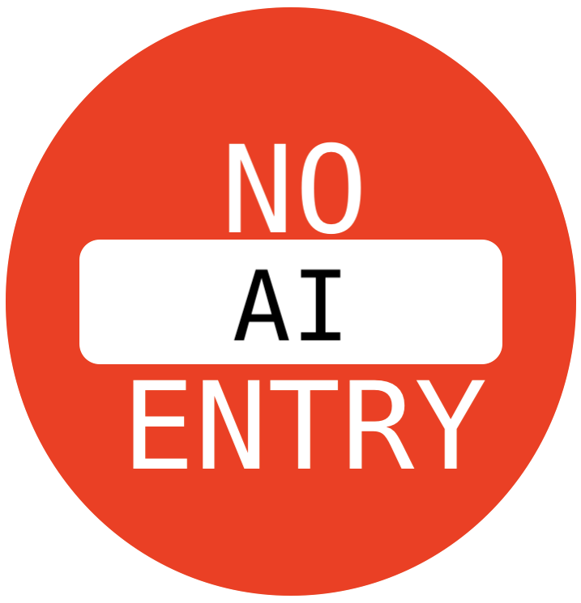

# AI robots.txt



This is an open list of web crawlers associated with AI companies and the training of LLMs to block. We encourage you to contribute to and implement this list on your own site.

A number of these crawlers have been sourced from [Dark Visitors](https://darkvisitors.com) and we appreciate the ongoing effort they put in to track these crawlers. 

If you'd like to add information about a crawler to the list, please make a pull request with the bot name added to `robots.txt`, `ai.txt`, and any relevant details in `table-of-bot-metrics.md` to help people understand what's crawling.

---

## Additional resources

**Spawning.ai**    
[Create an ai.txt](https://spawning.ai/ai-txt#create): an additional avenue to block crawlers. Example file:

```text
# Spawning AI
# Prevent datasets from using the following file types

User-Agent: *
Disallow: /
Disallow: *
```

**[Have I Been Trained?](https://haveibeentrained.com/)**    
Search datasets for your content and request its removal.


---

Thank you to [Glyn](https://github.com/glyn) for pushing [me](https://coryd.dev) to set this up after [I posted about blocking these crawlers](https://coryd.dev/posts/2024/go-ahead-and-block-ai-web-crawlers/).
